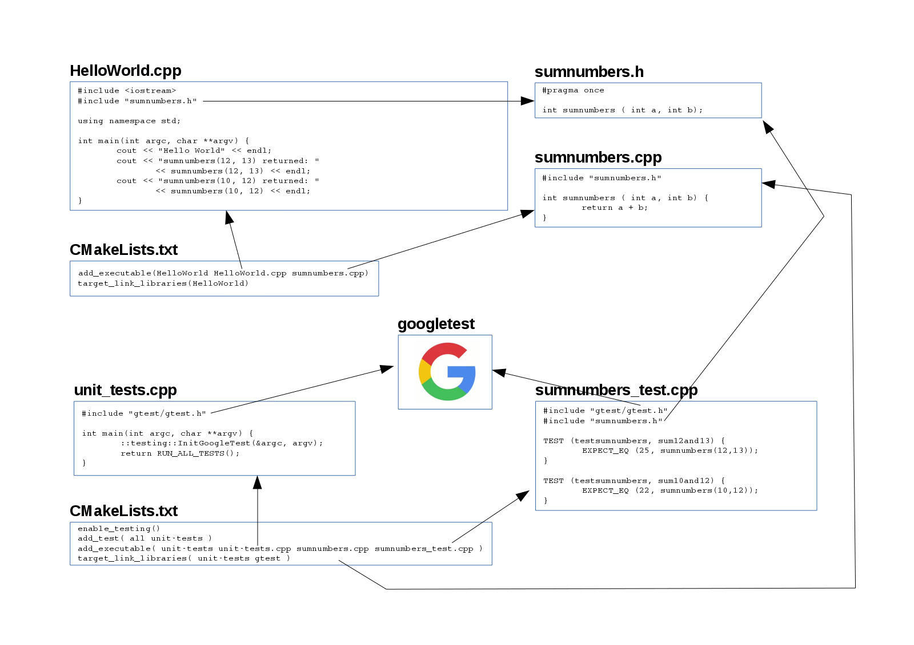

# Google Test Example

Here I explore the GoogleTest framework and how the files all fit together.
This project uses the wisdom found in this blog post https://crascit.com/2015/07/25/cmake-gtest
to let CMake download the GoogleTest code automatically and then compile against it.

First we have the HelloWorld program which includes the sumnumbers.h header file.
The header file just declares that a function sumnumbers will exist. We must make
sure that the sumnumbers.cpp implementation is also compiled and linked into
our program. This is done by adding it to the add_executable line in the CMakeLists.txt
file. Together this creates an executable HelloWorld. It knows nothing about GoogleTest.

Then separately we have the unit_tests.cpp file which we use to create a unit_tests
executable. This includes gtest.h which has magic to find the TEST tests in the cpp
files that are on the add_executable line.
