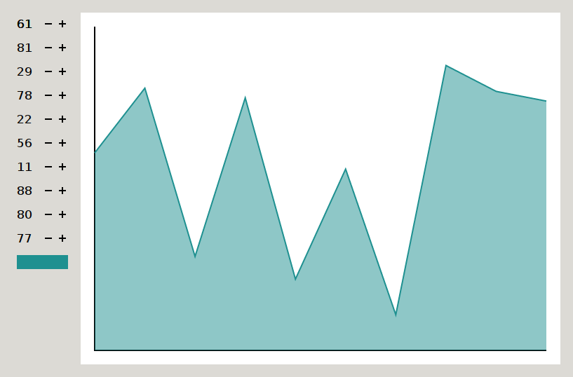
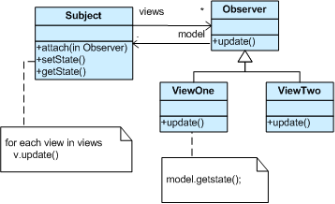

# The observer design pattern

The _observer pattern_ defines a `one-to-many` dependency between objects so that when one object changes state, all of its dependents are notified and updated automatically.

## The observer pattern in action

## A Class diagram

## Storing the observer in the subject

- Extending an `Observer` class and store the casted object:  
  It works but you need pointers.
- Creating a vector of function pointers:

  ~~~.cpp
    #include <iostream>
    #include <vector>
    #include <functional>
    class Subject
    {
        public:
            void register(std::function<void(int)> func)
            {
                views.push_back(func);
            }
            void set(int v) {value = v; notify();}
        private:
            int value{0};
            vector<void(int)> views;
            void notify()
            {
                for (auto f: views)
                {
                    f(v);
                }
            }

    };

    class FirstView
    {
        public:
            FirstView(Subject mode)
            {
                mode.register([this](int value) {update(value);}
            }
        private:
            void update(int value)
            {
                cout << "value: " << value << endl;
            }
        
    };

    int main()
    {
        Subject subject;
        FirstView view1(subject);
        subject.set(15);
    }
  ~~~

## Push and pull

- Push: the subject passes each time the changed value to each view
- Pull: the subject notifies each view that a change happened; the view has a reference back to the subject and can ask for current values.

## Implementation

- There is no standard implementation.
- Boost has an implementation.
- The best implementation are probably Qt's "signal and slots".

It's not easy to come up with a

- fast
- simple (few macros / no external pre-processing / good template error messages)
- readable

solution.

# The conclusion

The observer pattern allows a loose coupled design between objects that interacts.
